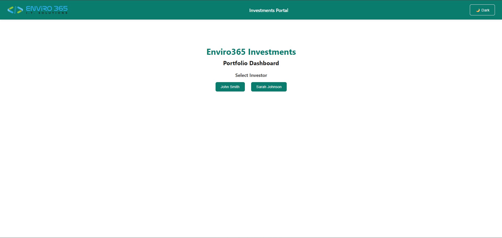
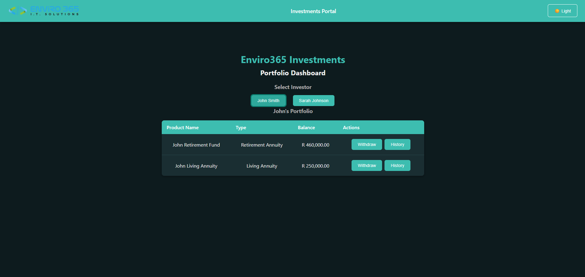
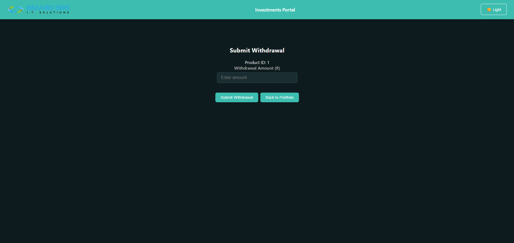
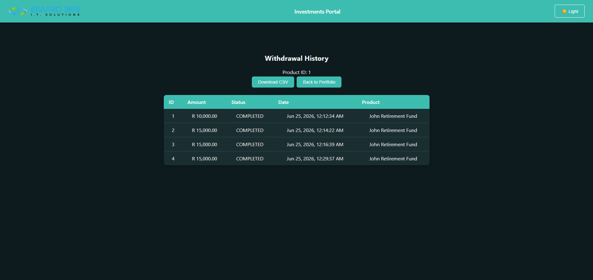

# Enviro365 Investments - Withdrawal Management System

## Overview
A full-stack withdrawal management system built with Spring Boot and Angular.

## Tech Stack
- Backend: Java 17, Spring Boot 4.1.0, H2 Database, JPA/Hibernate
- Frontend: Angular, TypeScript, CSS

## Setup Instructions

### Backend
1. Clone the repository
2. Open in IntelliJ IDEA
3. Run `Enviro365Application.java`
4. Backend runs on `http://localhost:8080`
5. H2 Console available at `http://localhost:8080/h2-console`
    - JDBC URL: `jdbc:h2:mem:enviro365db`
    - Username: `SA`
    - Password: (leave empty)

### Frontend
1. Navigate to `enviro365-frontend` folder
2. Run `npm install`
3. Run `ng serve`
4. Frontend runs on `http://localhost:4200`

## API Documentation

| Method | Endpoint | Description |
|--------|----------|-------------|
| GET | /api/investors | Get all investors |
| GET | /api/investors/{id} | Get investor by ID |
| GET | /api/investors/{id}/products | Get investor products |
| POST | /api/withdrawals/product/{productId}?amount= | Create withdrawal |
| GET | /api/withdrawals/product/{productId} | Get withdrawal history |
| GET | /api/withdrawals/export?productId= | Export CSV |

## Business Rules
- Retirement withdrawals only allowed for investors older than 65
- Withdrawal amount cannot exceed the product balance
- Withdrawal amount cannot exceed 90% of the product balance

## Advanced Features Implemented
- Global exception handling with clean JSON error responses
- DTO layer to control data exposure
- Input validation with meaningful error messages

## AI Usage Disclosure
- AI was primarily used to assist with planning the project's architecture and defining the overall structure of the application. Rather than providing direct solutions, it served as a mentor and learning guide, helping to identify potential approaches and encouraging critical thinking throughout the development process.
- Whenever challenges arose, AI was used to explore possible solutions and provide guidance, but only after a genuine attempt had been made to solve the problem independently. The goal was not to rely on AI as a code generator, but to use it as a tool for learning, problem-solving, and gaining a deeper understanding of software development concepts.
- All architectural decisions were carefully considered and reasoned through, with AI providing guidance rather than making decisions on my behalf. As a result, I fully understand and can confidently explain every component, feature, and piece of code within this project.

## Screenshots Section

